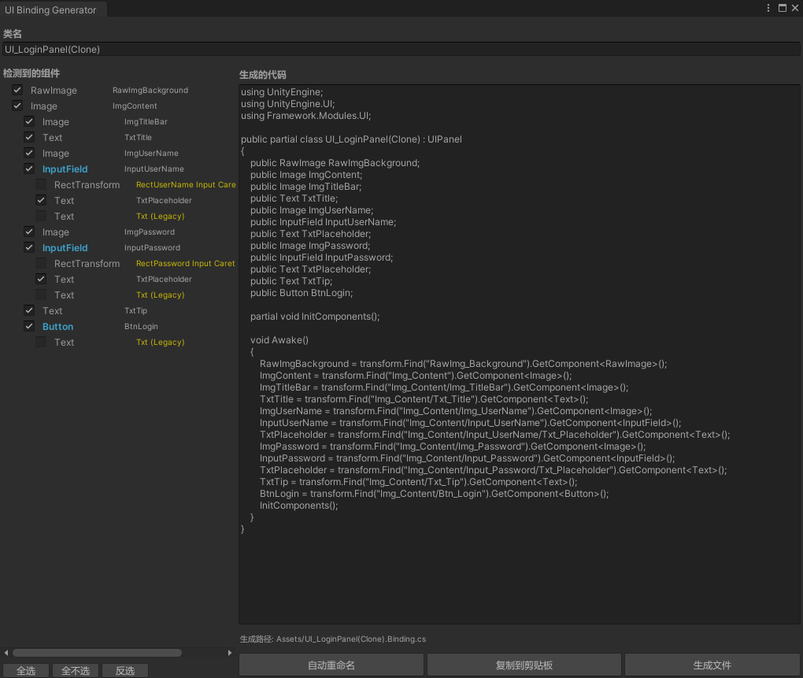
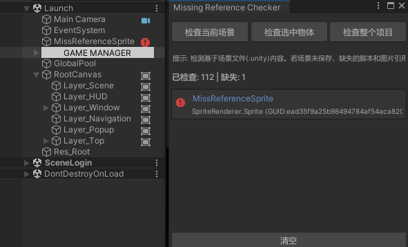

# Unity 工业级架构演示工程

这是一个用于求职展示的 Unity 综合案例，重点展示了**工业级代码分层**、**模块化架构设计 (QFramework 思想)**、**双端全量热更新流**以及**生产力工具链实现**。

## 项目结构概览&#x20;

```text
Assets/Game
├── Launch.unity           # 引导底座场景 (YooAsset初始化)
├── GameRes/               # 动态资源树 (受热更管理)
└── _Scripts/              # 逻辑核心
    ├── Main/              # [AOT层] 启动引导、HybridCLR热更驱动
    ├── Framework/         # [内核层] Framework核心与通用中间件
    │   ├── Common/        # 跨平台核心逻辑 (Core, Utils)
    │   │   ├── Core/      # Architecture, IOC, BindableProperty
    │   │   └── Modules/   # 通用组件 (Config, Http, Res, UI, Pool, Timer)
    │   └── Unity/         # Unity深度集成驱动
    │       └── Editor/    # 工业化工具集 (UI绑定生成、分析器Overlay、引用检查)
    └── Hotfix/            # [热更层] 核心业务逻辑实现 (C# DLL)
        ├── App/           # 全局架构驱动 (GameArchitecture, GameManager)
        ├── Procedures/    # 流程控制 FSM (Launch, Preload, Login, Main)
        ├── Shared/        # 业务共享定义 (Configs, DTOs, Consts, Utils)
        ├── Gateways/      # [通讯网关层] IServerGateway 抽象
        │   ├── LocalServerGateway.cs    # 离线模拟服务器驱动
        │   ├── Controllers/             # [本地服务端逻辑] 模拟后端控制器
        │   └── NetworkServerGateway.cs  # 真实网络服务器 (HTTP/WebSocket)
        ├── Modules/       # 典型业务模块 (统一五层架构)
        │   ├── Inventory/ # 背包系统 (增量同步/响应式字典)
        │   ├── Shop/      # 商店系统 (限购逻辑/服务端同步)
        │   └── ...        # 其他系统模块
        └── Gameplay/      # 核心玩法 space (独立子架构隔离)
            └── Demo1/     # 卡牌自走棋演示

Tools/                     # 外部工具链
└── ExcelExporter/         # 基于NPOI的自动化导表流水线
```

***

## 架构职责详述

### \[Assets/Game] 启动环境

- **Launch.unity**：框架点火场景，负责初始化 YooAsset 环境并引导后续流程。
- **GameRes**：分模块管理的动态资源仓库，支持资源热更与按需下载。

### \[\_Scripts]

#### 1. Main

- **职责**：负责热更 DLL 的加载注入以及 AOT 元数据的补充，是整个热更机制的起点。

#### 2. Framework

##### Common (通用模块)

- **Core**：提供基于 QFramework 思想的基类及响应式数据绑定核心，实现数据驱动 UI。
- **Modules (标准化组件)**：
  1. **UI 系统**：基于 UIPanel 与层级管理器的窗体控制系统。
  2. **资源系统 (Res)**：对接 YooAsset 的异步加载与生命周期管理。
  3. **流程系统 (Procedure/FSM)**：控制游戏冷启动到主循环的逻辑切换。
  4. **网络系统 (Network/Http)**：支持 UniTask 驱动的 HTTP 与 WebSocket。
  5. **配置系统 (Config)**：JSON 静态数据的集中加载与解析中心。
  6. **对象池 (Pool)**：针对 GameObject 与内存对象的通用复用池。
  7. **计时器 (Timer)**：支持高精度延时触发与循环任务。

##### Unity/Editor (依赖UnityEngine)

1. **UI 绑定生成器**：一键将 Prefab 节点映射为 C# 变量，省去手写引用。
2. **UI 性能分析 Overlay**：在场景视图直接监测 Raycast 命中点与 Overdraw。
3. **资源引用检查器**：自动化扫描项目中的预制体丢失引用或异常。

#### 3. Hotfix (动态业务区)

##### App & Procedures (流程控制)

- **职责**：利用状态机维护从启动、预加载到登录、主页的游戏全局生命周期。

##### Gateways (通讯网关实现)

1. **IServerGateway**：屏蔽底层协议差异的统一调用入口。
2. **LocalServerGateway**：内含本地数据库与控制器的离线模拟服务器。
3. **NetworkServerGateway**：用于线上环境的生产级别网络请求网关。

##### Modules

每个业务模块均按 Model-Service-Syncer 标准三层结构开发，Model数据驱动UI，Service提供操作，UI执行Command调用Service，通知后端后，后端确认通过后下发 ws 带数据版本的局部更新和 Http 响应结束Loading，Syncer 接收后端更改 Model：

1. **Auth (认证)**：处理登录、注册与 Token Session 维护。
2. **Inventory (背包)**：支持增量同步、响应式字典与道具操作。
3. **Shop (商店)**：包含限购逻辑、货币核销与商品刷新策略。
4. **Player (玩家)**：处理体力、等级等基础属性的数据同步。
5. **Mail (邮件）**：完整的业务逻辑闭环，包含领取附件

##### Gameplay (玩法空间)

采用独立子架构隔离模式，逻辑与外界完全解耦：

1. **Demo1**：模仿《大巴扎》的卡牌自走棋原型演示

***

## 生产力工具集

- **ExcelExporter**：导表工具，支持 JSON 导出与全量结构验证。

***

## 总结

本框架参考了参考了QFramework的核心分层，以及BindableProperty，综合开发经验中所必需的工具集编写，Main（AOT）包含了基础的系统设置和资源更新后，再加载的Framework和Hotfix（业务），基于YooAsset和HybridCLR实现的资源和代码热更新，完全适用于商业中小型游戏开发。

## 附录





<video src="联网业务.mp4"></video> <video src="demo演示.mp4"></video>
